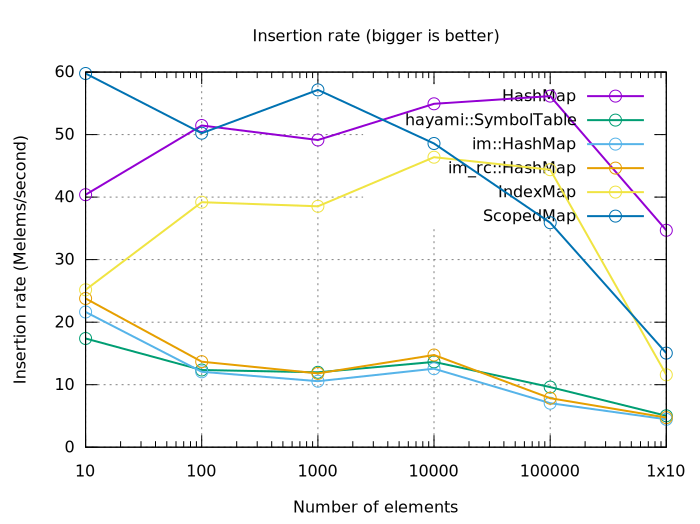
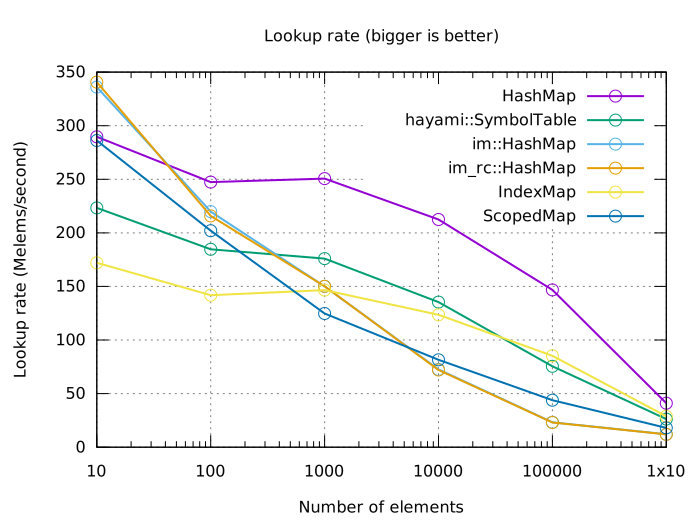

# `ScopedMap` -- an arena-allocated persistent hash map

[](https://opensource.org/licenses/MIT)

A `ScopedMap` is an arena-allocated [HAMT], designed for use in tree-traversing
algorithms where data is accumulated as the tree is descended.

[HAMT]: https://en.wikipedia.org/wiki/Hash_array_mapped_trie

For example, you could use it in a compiler or interpreter for lexical scope.

## Example

```rust
use scoped_map::{ScopedMap, ScopedMapBase};

let base = ScopedMapBase::new();
let mut map = base.make_map();

map.insert('a', "apple");
map.insert('b', "banana");
{
    // O(1) copy
    let mut sub_map = map.new_scope();
    sub_map.insert('c', "citrus? idk");

    assert_eq!(sub_map.lookup(&'a'), Some(&"apple"));
    assert_eq!(sub_map.lookup(&'b'), Some(&"banana"));
    assert_eq!(sub_map.lookup(&'c'), Some(&"citrus? idk"));

    // Original map still accessible, and unmodified
    assert_eq!(map.lookup(&'c'), None);
}
map.insert('d', "dragonfruit");
```

`ScopedMap` features:

 * *O*(1) borrowing copy
 * *O*(log *n*) lookup and insert, where the base of the logarithm is so large
   (16) that it's practically constant-time
 * Fast

The borrowing copy restricts its usefulness to a particular use pattern, and its
goal is to be the best map for this purpose.

Compared to `im_rc::HashMap`:
 * `ScopedMap` has faster insertion thanks to its fast arena allocation of new
   blocks
 * `ScopedMap` sometimes has slower lookup
 * `ScopedMap` never clones entries, so it's possible to use interior mutability
   in the values

## Things you can't do

TODO

## Benchmarks

These are some simple benchmarks of various maps, including `hayami::SymbolMap`,
which is designed for a similar purpose.

This only measures insertion and lookup on a single map, with no copies. Keep
in mind that the hashmaps compared don't have feature parity -- for instance,
`std::HashMap` and `IndexMap` lack *O*(1) copy operations.

Benchmarks run on my laptop while also doing other things, only trust them to
±20%.




## Design

It uses HAMT with blocks of size 16. They're not sparse blocks.  (Compare to the
`im` crate, which AFAICT uses sparse blocks of size 32.)

Sparse blocks pros:

 * More memory efficient
 * Allows for larger block sizes, which means a shallower tree, faster
   lookup/insert

Sparse block cons:

 * A lot of work, and maybe not even possible in a memory-efficient way with an
   arena allocator
 * Shallower tree also means less sharing is possible, so there's more copying
   and memory use


TODO:
 * bench a `LinkedList<'a, std::collections::HashMap>`
 * bench a `std::collections::HashMap` with just `clone`ing it
 * ~~Do the map contents really need to be `'static`?~~ No they don't; updated
   in 0.2.0
 * Try different block sizes?
